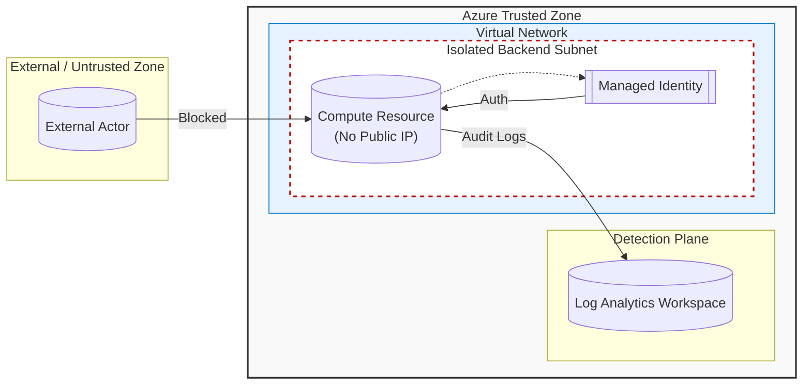

# Azure Infrastructure Security: Cloud Architecture Study
[](https://github.com/supakan0409/Azure-secure-landing-zone/actions/workflows/security-scan.yml)

This repository represents a **Proof of Concept (PoC)** for designing a secure cloud infrastructure. The primary goal is to gain hands-on experience with **Infrastructure as Code (IaC)** using **Azure Bicep**, while understanding the fundamental components of a secure and scalable cloud environment.

It serves as a study on how to harden a basic landing zone against common attack vectors.

---

## 🛡️ Key Features
### 1. Infrastructure as Code (Bicep)
* **Modular Design:** Resources are defined in Azure Bicep for repeatability and consistency.
* **Visibility First:** Deploys **Azure Log Analytics Workspace** as the foundation for centralized logging.
* **Network Security:** Implements **Virtual Network (VNet)** segmentation and **Network Security Groups (NSG)** with enabled diagnostic logs.

### 2. Identity & Zero Trust
* **Credential-less Compute:** Utilizes **User Assigned Managed Identity** for Virtual Machines to eliminate hardcoded credentials in the codebase.
* **Private Access:** VMs are deployed without Public IPs to reduce the attack surface.

### 3. Automated Security
* **CI/CD Pipeline:** Powered by **GitHub Actions.**
* **Static Analysis (SAST):** Integrates **Checkov** to automatically scan Bicep files for security violations (e.g., unencrypted disks, open ports) on every push.

## 🧩 Architecture & Security Boundaries


> [!IMPORTANT]
> **Key Posture:** This architecture enforces a "Deny-by-Default" stance. The Backend Subnet is completely isolated from direct internet ingress.

## 🛠️ Tech Stack & Tools Used
| Category | Technology | Usage |
| :--- | :--- | :--- |
| **Cloud Provider** | Microsoft Azure | Target Infrastructure |
| **IaC** |  Azure Bicep | Infrastructure Definition |
| **CI/CD** | GitHub Actions | Automation Pipeline |
| **Security Scanning** | Checkov | Static Code Analysis (IaC Security) |
| **Scripting** | Azure CLI | Deployment Commands |

## 💻 How to Deploy
### Prerequisites

* Azure Subscription (Free Tier / Student)
* Azure CLI installed
* GitHub Account

### Deployment Steps
**1. Clone Repository:**
```bash
git clone https://github.com/supakan0409/Azure-secure-landing-zone.git
cd Azure-secure-landing-zone
```
**2. Login to Azure:**
```bash
az login
```
**3. Deploy via CLI (Manual Test):**
```bash
az group create --name RG-Security-Lab --location koreacentral
az deployment group create --resource-group RG-Security-Lab --template-file main.bicep
```

### ⚠️ Disclaimer
This project is for **educational and research purposes.** While it implements security best practices, a production environment would require additional controls.

---
**Developed by Supakan | © 2026 Academic Research Project | All Rights Reserved.**
